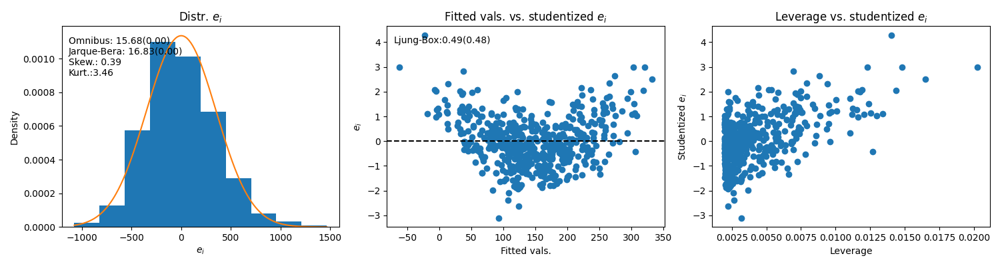
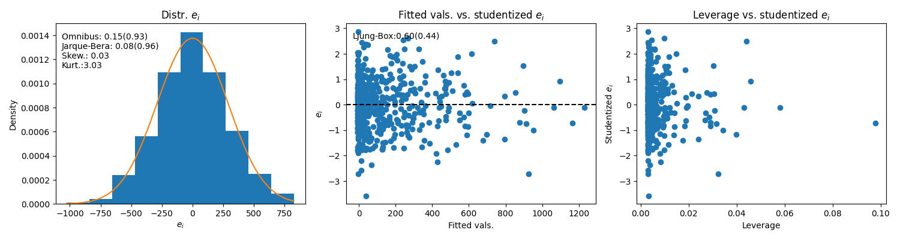
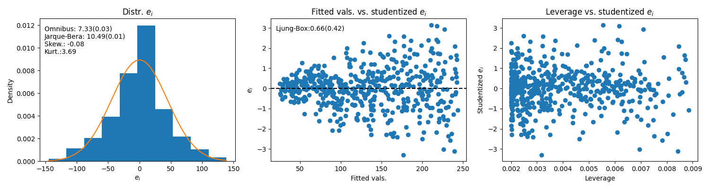
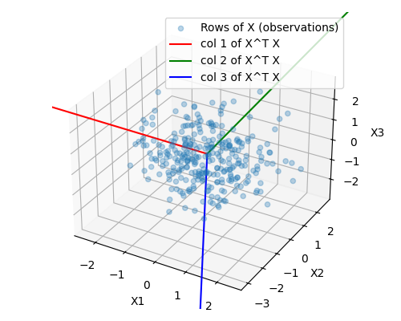
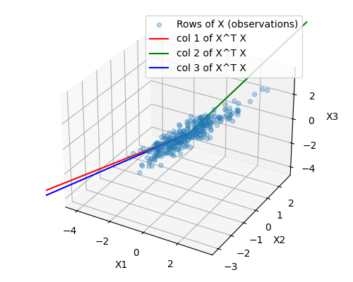
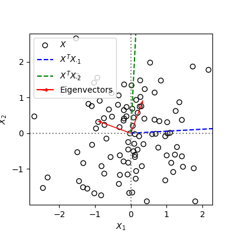
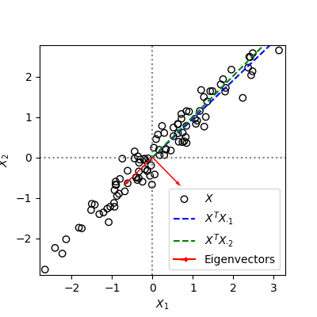

# Regression

Based largely on 

- James., G., Witten, D., Hastie, T., Tibshirani, R. (2017). An Introduction to Statistical Learning with Applications in R. Springer. ISBN 978-1-4614-7137-0

- Hastie, T., Tibshirani, R., Friedman, J. (2017). The Elements of Statistical Learning. Data Mining, Inference, and Prediction. Springer

- https://ocw.mit.edu/courses/18-06-linear-algebra-spring-2010/

## Ordinary least-squares - OLS

### Model and intuition

The model in OLS is $y = X\beta + \epsilon$, with $\epsilon_i \sim N(0, \sigma^2)$, $\beta= \langle\beta_0, \beta_1\rangle$ and $X$ a **fixed** (non-random) column vector (we prepend a column of ones on the left for the intercept). The deterministic part is $X\beta$, which is a model for $E(y \mid X)$. $\epsilon$ is the random deviation of each $y_i$ from $E(y \mid X)$, and is what makes $y$ a random variable.

The modelling task in OLS is to estimate $\hat{\beta}$ and its variability. That gives us a function to estimate of $E(y \mid X)$ and a way to compute confidence intervals. $X$ is a matrix with $p+1$ columns (+1 for the intercept) and $n$ rows, where $p$ is the number of regressors and $n$ is the number of observations. In OLS, $p=1$.

Geometrically, predicting $E(y \mid X)$ corresponds to projecting $y$ onto the column space of $X$, that is, finding a linear combination $\hat{\beta}$ of the columns of $X$ that minimizes the residuals vector $e = y - \hat{y}$, where $\hat{y} = X\hat{\beta}$. Since $e$ and $X$'s column space are orthogonal, we can say $X^T(y - X\hat{\beta}) = 0$. Solving for $\hat{\beta}$ yields:

$\hat{\beta} = (X^TX)^{-1}X^Ty$

Since this is a sample estimate, we need to check if it's expected value (given $X$) is equal to the population value $\beta$, i.e., check whether $\hat{\beta}$ is an unbiased estimator of $\beta$. The expected value of $\hat{\beta}$ given $X$ is $E(\hat{\beta} \mid X) = E((X^TX)^{-1}X^Ty)$ (I'll only write $...\mid X$ at certain places to keep syntax short, but it will always be the expectation given $X$). Substituting in the model for $y$ we get $E(\hat{\beta}) = E((X^TX)^{-1}X^T(X\beta + \epsilon))$, and expanding leads to $E(\hat{\beta}) = E((X^TX)^{-1}X^TX\beta + (X^TX)^{-1}X^T\epsilon)$. Since $(X^TX)^{-1}X^TX = I$ and $\beta$ is a constant, the first term reduces to $\beta$. Then we get $E(\hat{\beta}) = \beta + E((X^TX)^{-1}X^T\epsilon)$. Given that we're taking the expected value given $X$, $(X^TX)^{-1}X^T$ in the second term can be taken out of the expectation, which leads to $E(\hat{\beta}) = \beta + (X^TX)^{-1}X^TE(\epsilon\mid X)$. 

At this point, we can say that $\hat{\beta}$ is unbiased whenever the second term is zero, i.e., when $E(\epsilon\mid X) = 0$. This condition is called _exogeneity_, and it applies when the errors $\epsilon$ do not vary systematically along $X$, i.e., when our model $y = X\beta + \epsilon$ is properly specified and it's not missing relevant regressors, non-linear terms, interactions, etc. If any relevant terms are missing (model misspecified), the assumption doesn't apply, $X$ contains information about $\epsilon$ and as a result $\hat{\beta}$ is biased. This is called _endogeneity_.

The variance of $\hat{\beta}$'s sampling distribution can be obtained as follows: 

$\text{Var}(\hat{\beta}) = \text{Var}((X^TX)^{-1}X^Ty)$. Substituting in the equation for $y$, we get $\text{Var}(\hat{\beta}) = \text{Var}((X^TX)^{-1}X^T(X\beta + \epsilon))$. Expanding leads to $\text{Var}(\hat{\beta}) = \text{Var}((X^TX)^{-1}X^TX\beta + (X^TX)^{-1}X^T\epsilon)$. Noting that $(X^TX)^{-1}X^TX\beta$ is a constant with respect to $X$ (and remembering that we're computing the variance given $X$), we get $\text{Var}(\hat{\beta}) = \text{Var}((X^TX)^{-1}X^T\epsilon)$. This is the variance of a constant ($(X^TX)^{-1}X^T$) times a random variable ($\epsilon$). We can take the constant out, which leads to $\text{Var}(\hat{\beta}) = (X^TX)^{-1}X^T \text{Var}(\epsilon)X(X^TX)^{-1}$ (we must square the constant, which with matrices is done by multiplying once by the constant and then by its transpose). Using the homoscedasticity assuption, we can say $\text{Var}(\epsilon) = \sigma^2I_n$, where $\sigma^2$ is a scalar and $I_n$ is the $n$ x $n$ identity matrix. With this simplification, we can put $\sigma^2$ in front and skip writing $I_n$ (the identity matrix): $\text{Var}(\hat{\beta}) = \sigma^2 (X^TX)^{-1}X^T X(X^TX)^{-1}$. Finally, noting that $(X^TX)^{-1}X^T X = I$, we get:

$\text{Var}(\hat{\beta}) = \sigma^2(X^TX)^{-1}$

This means that, **under the homoscedasticity assumption** (!), $\text{Var}(\hat{\beta})$ is related to 1) the variance of the residuals $\sigma^2 = \text{Var}(\epsilon)$ and 2) $X^TX$ (so-called Gram matrix), which captures the degree to which regressors line up in $n$-dimensional space ($n$ = no. observations).

### A few notes on $E(\hat{\beta})$ and $\text{Var}(\hat{\beta})$

$\sigma^2$ is not observable, so we have to use the sample estimate $\text{RSE} = \hat{\sigma}^2 = \text{RSS}/(n-p-1)$, with $p$ = no. regressors (=1 in OLS) and $\text{RSS} = e^Te$, where $e$ = sample residuals (see below). Note that $e^Te$, which is a scalar, is not the same as $ee^T$, which is the variance-covariance matrix of the sample residuals (see section on heteroscedasticity below). $\text{RSE}$ = Residual Standard Error and $\text{RSS}$ = Residual Sum of Squares. We're allowed to use $\text{RSE}$ as an estimate of $\sigma^2$ becasue, _if the OLS assumptions hold_, $E(\hat{\sigma}^2) = E(\text{RSE}) = \sigma^2$

The entries in $X^TX$ are just the dot-products $X_j^TX_j$ for the diagonal elements and $X_j^TX_{-j}$ for the off-diagonal elements. The former are related to the variance of regressor $X_j$ and the latter to the pairwise covariances between $X_j$ and each of the other regressors $X_{-j}$.

In general, larger samples with more spread $X$ have smaller variability in $\hat{\beta}$ upon replication; the mechanism is simply that larger samples encompass a larger part of the population and hence have better chances of representing it well. In turn, more spread in $X$ implies more chances to capture the way $y$ varies over $X$. Conversely, a narrow interval of $X$ doesn't allow that and therefore leads to more variable (i.e., more uncertain) estimates of $\hat{\beta}$ upon replication.

All the above formulas are only valid if $\text{Cov}(X, \epsilon) = 0$, and here I really mean the _unconditional_ covariance (since the covariance of $X$ and $\epsilon$ at a fixed $X$ is always zero: $\text{Cov}(\epsilon, X \mid X) = E([X - E(X \mid X)][\epsilon - E(\epsilon \mid X)]^T) = E([X - X][\epsilon - E(\epsilon \mid X)]^T) = E(0[\epsilon - E(\epsilon \mid X)]^T) = 0$). The intuition behind $\text{Cov}(X, \epsilon) = 0$ is that if $\epsilon$ is related to the regressors $X$, $\epsilon$ contain information about the part of $y$ that is supposed to be only noise, i.e., there's still variance in $\epsilon$ that is linked to $X$. It's also possible that an omitted variable is moving with $X$ and thus affecting $y$ indirectly. This then causes $X$ and $\epsilon$ to be related. It's also worth noting that, with multiple regressors, checking which $X$ is responsible for $\text{Cov}(X, \epsilon) \neq 0$ helps determining which regressor is driving the residuals.

### Two different assumptions: $\text{Cov}(X, \epsilon) = 0$ and $E(\epsilon \mid X) = 0$

$\text{Cov}(X, \epsilon) = 0$ only means that $\epsilon$ and $X$ are unrelated **on average**, i.e., the weighted average of their co-movement is zero, so they are not associated in the aggregate. However, **this is not what OLS is based on** because what we need in order to have a well-specified model for $y$ is for $\epsilon$ to have no relation to $X$ **anywhere along $X$**, i.e., for there to be no **local** systematic relation between $\epsilon$ and $X$. This is where $E(\epsilon \mid X) = 0$ comes in. That is the _exogeneity_ assumption, which says that there's no systematic variation in the model errors **as we move along $X$**, i.e., no local deviations anywhere over all values of $X$, **not just on average**. In other words, it's possible to have $\text{Cov}(X, \epsilon) = 0$ and still have $E(\epsilon \mid X) \neq 0$, i.e., somewhere along $X$ we have systematic deviations. In contrast, if $E(\epsilon \mid X) = 0$ we are guaranteed to have $\text{Cov}(X, \epsilon) = 0$.

### A note on predicted values $\hat{y}$

Since $\hat{\beta} = (X^TX)^{-1}X^Ty$, the estimated values are $\hat{y} = X\hat{\beta} = X(X^TX)^{-1}X^Ty$. The product $X(X^TX)^{-1}X^T$ is known as the 'hat' matrix $H$, since multiplying it with $y$ generates $\hat{y}$. Geometrically, $X(X^TX)^{-1}X^T$ is a projection matrix, i.e., it's the matrix that projects $y$ onto the column space of $X$. Further, the matrix-vector product $Hy$, which is computed as 

$$\hat{y}_i = \sum_{j=1}^n h_{i,j}y_j$$

indicates that each $\hat{y}_i$ is a linear combination of all observed $y_i$, and that the degree to which each $y_i$ influences a given $\hat{y}_i$ is given by the corresponding row of $H$.

Another important fact about $H$ is that each of its diagonal elements $h_{i,i}$ is equal to the _leverage_ of the corresponding observation $(x_i, y_i)$. The diagonal entries of $H$ are $h_{i,i} = x_i(X^TX)^{-1}x_i^T$, and this measures how distant (from the center) $x_i$ is in the column space of $X$. Factor $(X^TX)^{-1}$ warps and scales space such that distance is measured in $X$'s column space instead of in Euclidean space, otherwise we'd simply have $\lVert x_i^2 \rVert$, i.e., the squared length of $x_i$. 

This 'distance', combined with an unusual value for $y_i$ (i.e., a large residual $e_i$), results in a strong _influence_ of that datapoint on $\hat{\beta}$, which in turn translates into a strong influence of that datapoint on the regression line as a whole. Leverage is relevant because if high-leverage points are also outliers, our entire analysis would be based on a single (or a few) atypical observations, which makes conclusions less reliable than if they were based on the dataset as a whole. It's also important to mention that leverage measures how 'unusual' a specific row of $X$, $x_i = \langle x_{i,1}, x_{i,2}, ..., x_{i,p} \rangle$, is **in p-dimensional space**, and this **cannot be assessed visually via pairwise comparisons** of the columns of $X$ unless $X$ has only two columns. The reason is that a given $x_i$ can be within range for two of the variables (columns of $X$) and still be unusual in the other $p-2$ dimensions.

Note: the off-diagonal elements of $H = X(X^TX)^{-1}X^T$ are $h_{i,j} = x_i(X^TX)^{-1}x_j^T$, and these measure the alignment or 'cross-similarity' of $x_i$ and $x_j$ in the column space of $X$. In turn, the diagonal elements $h_{ii} = x_i(X^TX)^{-1}x_i^T$ measure the 'self-similarity' of $x_i$ with itself, which is actually the distance mentioned above (that distance is measured along the principal components of $X$).

Leverage is also important because it's needed to obtain studentized residuals; these are key for determining outliers because it's easier to spot them on a standard scale than on $y$'s natural scale. That standardization is done by divding each residual $e_i$ by its variance, which is equal to $\text{Var}(e_i) = \sigma^2(1-h_{ii})$. Intuitively, this relation means that residuals of datapoints with more leverage have less variability upon replication because those points 'pull' the regression line more strongly towards them. Thus, every replication leads to a regression line that moves little with respect to those high-leverage points.

### Sums of squares and $R^2$

After finding $\hat{\beta}$ we can compute $\hat{y}$, which is an estimate of $E(y\mid X)$. We can then also compute sample residuals $e_i = y_i - \hat{y}_i$. With $e_i$ we can compute sample estimates for the distribution of $\epsilon$, which we obviously don't have so we're forced to use $e$'s distribution as a proxy. A first measure of interest is $\sigma^2$, i.e., the variance of $\epsilon$'s distribution.

We estimate this quantity with the **residual standard error** $RSE = \sqrt{\text{RSS}/(n-2)}$, where the **residual sum of squares** $\text{RSS} = \sum_{i=1}^n (y_i - \hat{y}_i)^2$ and $n-2$ are the degrees of freedom when computing $\text{RSE}$ in OLS. We lose 2 degrees of freedom becasue we need to estimate two parameters, $\hat{\beta}_0$ and $\hat{\beta}_1$, to calculate $\text{RSE}$. In MLR (see below) we lose $p + 1$ degrees of freedom ($p$ = no. regressors; + 1 for the intercept).

These sums of squares can be used to compute the % of explained variance in the regression, the $R^2$ statistic. $R^2 = 1 - \text{RSS}/\text{TSS}$, where the **total sum of squares** $\text{TSS} = \sum_{i=1}^n (y_i - \bar{y})$. The $R^2$ statistic measures the **linear** association between $X$ and $y$. In bivariate regression, the $R^2$ statistic is equal to the square of the _correlation coefficient_ $r^2$, which is equal to $\text{Cov}(X,y)/(\sqrt{\text{Var}(X)\text{Var}(y)})$. This is **not** true for multivariate settings.

Informally, looking at the size of RSS relative to the mean of $y$ is a way to assess how big unexplained variation is relative to the overall size of the response.

### OLS diagnostics

Before interpreting $\hat{\beta}_0$ and $\hat{\beta}_1$ and their statistical and business significance, we must check whether the linear model fit is usable. Several steps here:

1. Normality of residuals: Look at histogram of $e_i$ (sample residuals, since the population residuals require the entire population, which we obviously don't have). Formal tests: **Omnibus**, **Jarque-Bera**. Both have $H_0$: Distribution of $\epsilon_i$ is normal. However, given the Central Limit Theorem, normality of residuals is less critical with larger sample sizes ($n > 30$)

2. Autocorrelation of residuals: Look at fitted values vs. $e$. A random pattern suggests (however does not prove!) true linearity between $X$ and $y$. Any trend means systematic over/underpredicting depending on $y$; for instance, small values of $y$ overpredicted and large values of $y$ underpredicted -> we're likely missing a quadratic term -> model is **misspecified**. There can of course be other trends in fitted vals. vs. residuals: points along bands -> missing categorical variable, points funnel-shaped -> heteroscedasticity, etc. Formal test: **Ljung-Box**. Tests $H_0$: Zero residual autocorrelation.

3. Fitted values vs studentized residuals: This plot allows finding outliers and patterns in residuals (the same as above). The fact that residuals are studentized makes it easier to determine outliers (when the $t$ value is higher than, say 3). 

4. Leverage v studentized residuals: Outliers are bad, but outliers with high leverage are worse. Points with high leverage have a strong influence on $\hat{\beta}$ and can therefore distort relations since the regression would be heavily biased by only a few datapoints. Outliers with low leverage are less problematic, although they increase $RMSE$ and therefore lead to lower $R^2$.

## Multiple linear regression - MLR

### Model and intuition

Model is the same as above: $y = X\beta + \epsilon$, with $\epsilon \sim N(0, \sigma)$, but now $\beta$ is a vector of shape ($p$+1, 1), with $p$ = number of regressors (+1 for the intercept), and $X$ is no longer a column vector but a matrix of shape ($n$, $p+1$), i.e, $n$ observations and $p$ factors (again, +1 for the intercept, for which we prepend a column of ones to $X$).

Having multiple regressors opens up a host of possibilities, good and bad. Good because the world is multidimensional and including multiple regressors accounts for this; bad becasue regressors could be non-independent, we could be missing the right regressors, and we are forced to select a model, not to mention the problems with wide $X$ matrices, i.e., $n < p$.

This entire presentation focuses on datasets where $n > p$, i.e., we have many more observations that features. If we view each feature of $X$ as an $n$-dimensional vector in $n$-dimensional space ('observation space'), what we have if $n > p$ is $p$ vectors spanning a _subspace_ of that space. In contrast, if $n<p$ then the $p$ vectors span the entire $n$-dimensional space (not just a subspace of it), and any vector (feature) beyond the $n$-th vector will unavoidably be a linear combination of all previous vectors. This means that $X$ is not _full rank_, $X^TX$ is _singular_ and the modelling problem is unsolvable because there are _infinitely_ many different $\beta$ that give the same fitted values.

In order to find $\hat{\beta}$ with $\hat{\beta} = (X^TX)^{-1}X^Ty$, **$X^TX$ must be invertible**, which requires the columns of $X$ to be _linearly indepenent_ (i.e., $X$ must have full column rank). The formula for $\text{Var}(\hat{\beta})$ is the same as in OLS (OLS is just a special case of MLR).

Intuitively, each entry $\hat{\beta}_j$ in **$\hat{\beta}$** is the slope of the relationship between $X_j$ and $E(y\mid X)$ _holding all other predictors fixed_. That is, $\hat{\beta}_j$ measures the **true** effect of $X_j$, or, in other words, it isolates the effect of $X_j$ by measuring it **in the presence of all other factors**. Indeed, the entries in vector $\hat{\beta}$ are 

$\hat{\beta}_j = \frac{r_j^Ty}{r_j^Tr_j}$

This is the **partial covariance formula**, and $r_j$ are the residuals of regressing $X_j$ against all other regressors $X_{-j}$. $r_j^Ty$ measures how much variation in $r_j$ lines up with variation in $y$, and dividing by $r_j^Tr_j$ sets that quantity in relation to the total variation in $r_j$.

The intuition behind partial covariance is: with multiple regressors, we can't directly use $X_j^Ty/(X_j^TX_j)$ to capture how much $X_j$ varies together with $y$. The reason is that the other regressors ($X_{-j}$) could also influence $X_j$. That means **what we need to look at is the covariance of $y$ with the part of $X_j$ that is not explained by the other regressors** - this is what 'the effect of $X_j$ holding all other regressors fixed' actually means. 

The part of $X_j$ not explained by the other regressors is captured by the residuals of regressing $X_j$ on all other regressors. $r_j$ can be understood as the 'isolated' variability of $X_j$, or as 'what remains' of $X_j$ after removing the influence of all other regressors. The covariance of that 'cleaned' $X_j$ with $y$ then gives the true, isolated effect of $X_j$ on $y$ in the presence of all other regressors. In terms of vectors and spaces, $r_j$ is always orthogonal to $X_{-j}$. Remember that a regression simply finds the projection of $y$ onto the column space of $X$, and the vector of residuals is the orthogonal distance between $y$ and that projection.

### Omitted variable bias

In practice, MLR is often used in _observational_ contexts, where it's hard to include all relevant variables and/or randomize observations in order to balance the effect of unseen factors. For this reason, it's important to explore what happens when we **omit relevant regressors** in MLR.

Intuitively, when we omit relevant regressors we are 'burying' their effect in the $\hat{\beta}_j$ of the factors we do include. This happens when the omitted regressors meet two conditions: 1) the omitted regressors correlate with $y$ **and** 2) the omitted regressors correlate with the included regressors. Formally: 

Suppose the true model is $y = X\beta + \epsilon$. Say $X$ is of shape (n, m), but we only include $k$ regressors ($k < m$), i.e., we leave $m-k$ regressors out of the model. We can say $X$ is made up of two parts (included and omitted columns), so we can write it as $X = [X_1 \ X_2]$, with $X_1$ = the included regressors and $X_2$ = the omitted regressors. Each of these is just a matrix, one with the included ($X_1$) and another with the omitted ($X_2$) columns of $X$.

With this split, we can write the true model as $y = X_1\beta_1 + X_2\beta_2 + \epsilon$, where we've also split $\beta$ into an included part $\beta_1$ and an omitted part $\beta_2$. By implication, $X\beta = X_1\beta_1 + X_2\beta_2$.

Then our incomplete model is $y = X_1\alpha + \delta$, and $\hat{y} = \hat{\alpha}X_1$, so $\hat{\alpha}$ is the regression coefficient we estimate when we only include the subset of regressors $X_1$ ($\delta$ is the error of this incomplete model). Now, by definition

$\hat{\alpha} = (X_1^TX_1)^{-1}X_1^Ty$. If we substitute in the true model for $y$, we can see how the missing $X_2$ influences $\hat{\alpha}$:

$\hat{\alpha} = (X_1^TX_1)^{-1}X_1^T(X_1\beta_1 + X_2\beta_2 + \epsilon)$. If we expand this:

$\hat{\alpha} = \beta_1[(X_1^TX_1)^{-1}X_1^TX_1] + (X_1^TX_1)^{-1}X_1^TX_2\beta_2 + (X_1^TX_1)^{-1}X_1^T\epsilon$ (the 1st term in square brackets is $I$, the identity matrix). This simplifies to:

$\hat{\alpha} = \beta_1 + (X_1^TX_1)^{-1}X_1^TX_2\beta_2 + (X_1^TX_1)^{-1}X_1^T\epsilon$

If we take the expected value given $X_1$, $X_2$  on both sides:

$E(\hat{\alpha} \mid X_1, X_2) = \beta_1 + E[(X_1^TX_1)^{-1}X_1^TX_2\beta_2 \mid X_1, X_2] + E[(X_1^TX_1)^{-1}X_1^T\epsilon \mid X_1, X_2]$. Since $E(\epsilon \mid X_1, X_2)=0$,

$E(\hat{\alpha} \mid X_1, X_2) = \beta_1 + (X_1^TX_1)^{-1}X_1^TX_2\beta_2$

This result indicates that the expected value of $\hat{\alpha}$ is the true value $\beta_1$ **plus a bias** (remember that bias = how much the expected value of our estimate deviates from the true value). That bias depends on 1) $\beta_2$ - the true effect of the omitted variable on $y$ and 2) $X_1^TX_2$ - how much the included and omitted regressors covary. Note that the second term also includes factor $(X_1^TX_1)^{-1}$, which has the effect of amplifying the bias caused by $X_1^TX_2\beta$ when the included regressors ($X_1$) are correlated among themselves (because that causes the elements of $(X_1^TX_1)^{-1}$ to blow up).

In summary, if we omit variables that are positively associated with $y$ and with $X_1$ (the included regressors) we will have inflated coefficients for the regressors we do include, since they represent the true value $\beta_1$ plus the bias $(X_1^TX_1)^{-1}X_1^TX_2\beta_2$. If the omitted variables are negatively associated with $y$ and with the included regressors, coefficient estimates will be smaller because the true effect will be dampened by the bias. In cases where the omitted variables have a positive (negative) relation with $y$ and a negative (positive) relation with $X_1$, the net effect depends on whether $\beta_2$ or $X_1^TX_2$ is larger. All of these effects can be amplified by correlation amongst the included regressors.

### Hypothesis test

In MLR, we test $H_0: \beta_j = 0$ vs. $H_A:$ at least one $\beta_j \neq 0$, and the test statistic is 

$F = \frac{(\text{TSS} - \text{RSS})/p}{\text{RSS}/(n-p-1)}$.

What $F$ does is set the model effects ($TSS - RSS$) in relation to the residuals. If $X$ and $y$ _are_ related, $\text{RSS}/p$ will be smaller than $(\text{TSS} - \text{RSS})/(n-p-1)$, making $F > 1$. $F$ follows an F-distribution, which determines how much larger than 1 $F$ must be to be statistically significant.

#### Testing individual or subsets of regressors

When deciding whether a subset $q$ of regressors is relevant, we can remove those $q$ regressors from the model, fit it, and compare the residual sum of squares of that reduced model $\text{RSS}_0$ with the $\text{RSS}$ of the full model (the one with all regressors).

If the omitted regressors are important, $\text{RSS}_0$ will be much larger than $\text{RSS}$, since omitting relevant regressors will lead to larger residuals. Formally, what we're doing is testing the hypothesis $H_0$: 

$\beta_{p-q+1} = \beta_{p-1+2} ... \beta_p = 0$, 

where $\beta_{p-q+1} = \beta_{p-1+2} ... \beta_p$ are the omitted regressors. The comparison is done via an F-test:

$F = \frac{(\text{RSS}_0 - \text{RSS})/q}{\text{RSS}/(n-p-1)}$,

where the numerator captures the rise in $\text{RSS}$ we observe by removing the $q$ regressors - this measures the contribution of the $q$ omitted regressors. Since this measures the contribution of $q$ regressors, we divide by $q$ in order to get the 'residual rise per omitted regressor'.

This same logic can be used to asses inividual regressors. Actually, if we square the $t$-value of each individual regressor in an MLR, we get the $F$ value of a regression that omits that variable. Again, the logic here is: if we remove regressor $X_j$ and fit the model, and then compare the resduals to the full model, there should be a increase in $\text{RSS}$ if $X_j$ was important. 

To test whether the omitted $q$ regressors are non-zero, we can't just fit a model with those $q$ regressors and check if they're non-significant. The reason is ommited variable bias - if the omitted $p-q$ regressors are correlated with the included ones, that bias will likely make $\hat{\beta}$ for the $q$ tested regressors non-zero. The only way to avoid this is to take those $q$ regressors out of the model and fit the other $p-q$ regressors. That way, we can check if removing those $q$ regressors affects $\text{RSS}$, which is what we check with the above F-test. Note: if the removed $q$ regressors are correlated with the included ones, the F-test will have less power (because the effect of the omitted $q$ variables will still bias the $p-q$ included regressors, and this will lead to slightly smaller $\text{RSS}_0$).

### Variable selection

In MLR, the first step is to do the F-test with all regressors to see if there's an effect at all of _any_ of the predictors. If we do reject $H_0$, we obviously want to know _which_ predictors are relevant. This is called **model selection**. See next chapter.

One interesting fact regarding including/removing variables is how $\text{RSS}$ and $\text{RSE}$ react to adding regressors. It's perfectly possible to have, say, a model with 3 regressors with an $\text{RSS}$ of 10 and an $\text{RSE}$ of 3.5, and then, after including a fourth regressor, have $\text{RSS}$ drop to 8 (becase $\text{RSS}$ can only drop with more regressors, since we're adding dimensions) while $\text{RSE}$ grows to 4. The reason is simple: given that $\text{RSE} = \sqrt{RSS/(n-p-1)}$, $\text{RSE}$ can grow if the drop in $\text{RSS}$ is smaller than the increase in $p$.

### Confidence and prediction intervals

The estimated mean of $y$ at some specific value $x_0$ ($x_0 = \langle x_{1,0}, x_{2,0}, ... x_{p,0} \rangle$, i.e., a specific row of $X$) is $\hat{y}_0 = x_0\hat{\beta}$, and it's normally distributed with mean $x_0\beta$ and variance $\text{Var}(\hat{y}_0) = \text{Var}(x_0\hat{\beta}) = x_0\text{Var}(\hat{\beta})x_0^T = \sigma^2x_0(X^TX)^{-1}x_0^T$. Since we don't have $\sigma^2$ we use $\hat{\sigma}^2 = s^2 = \text{RSS}/(n-p)$. With these quantities we can build a **confidence interval** for $\hat{y}_0$:

$$\hat{y}_0 \pm t_{1-\alpha/2, n-p}\sqrt{\frac{\text{RSS}}{(n-p)}x_0(X^TX)^{-1}x_0^T}$$

This confidence interval captures how our estimate $\hat{y}_0$ varies upon replication. It reflects the fact that our estimate of $E(y\mid X=x_0)$ is based on a sample, and it's only equal to the actual population value in the limit. 

**Prediction intervals** capture the uncertainty of predicting, not the mean of $y$ given $X$, but a **specific value** $y_0$ at a specific $x_0$, i.e., an individual realization of the random variable $y$. Because this is a harder prediction task, prediction intervals are wider than confidence intervals. The reason is that, even if we could magically sample the entire population, fit a model with that 'data', and then make a prediction for $y_0$, we'd indeed get the true $E(y\mid X=x_0)$ (confidence interval collapses to a point) but we'd still have a _distribution_ of values around that true mean, simply because **$y$ is a random variable**. 

Formally, $y_0$ is the actual value at $x_0$ and our prediction is $\tilde{y}_0 = x_0\hat{\beta} + \epsilon_0$. Notice we _must_ include $\epsilon_0$ because we're predicting a single value of the distribution, which is mean + random deviation ($\epsilon_0$). Again, we need the variance of this prediction to build the prediction interval: $\text{Var}(\tilde{y}_0) = \text{Var}(x_0\hat{\beta} + \epsilon_0)$. Assuming that 1) $\epsilon_0$ is independent of $\hat{\beta}$ (which indirectly is the same as assuming $\epsilon$ and $X$ are uncorrelated) and 2) errors are homoscedastic, we can write $\text{Var}(\tilde{y}_0) = \text{Var}(x_0\hat{\beta}) + \text{Var}(\epsilon_0) = x_0\text{Var}(\hat{\beta})x_0^T + \sigma^2$. Substituting in the value of $\hat{\beta}$ and factoring out $\sigma^2$ leads to $\text{Var}(\tilde{y}) = x_0(X^TX)^{-1} x_0^T\sigma^2 + \sigma^2 = \sigma^2(1 + x_0(X^TX)^{-1}x_0^T)$. This result is basically a sum of the uncertainty in $\hat{\beta}$ (the second term) and the variability of $y$ around its true mean $E(y\mid X=x_0)$ (the first term). With this variance, the prediction interval for $\tilde{y}_0$ is:

$$\hat{y} \pm t_{1-\alpha/2, n-p}\sqrt{\frac{\text{RSS}}{n-p} (1 + x_0(X^TX)^{-1}x_0^T)}$$

Notice this is very similar to the confidence interval except for the $1+$ in the square root, which accounts for the population-level variability in $y$. Like the confidence interval, the prediction interval is also centered at $\hat{y}$.

## Key issues in MLR

### Interaction terms

MLR has two big assumptions: effects are 1) _linear_ - the effect of $X_j$ on $y$ is the same at all values of $X_j$ and 2) _additive_ - the effect of $X_j$ on $y$ does not depend on the other predictors $X_{-j}$. Including interaction between regressors relaxes the second assumption. 

Formally, if our original model is $y = \beta_0 + \beta_1X_1 + \beta_2X_2 + \epsilon$, we can replace $\beta_1$ by $\tilde{\beta}_1$, which we then define as a function of $X_2$. The new model is $y = \beta_0 + \tilde{\beta}_1X_1 + \beta_2X_2 + \epsilon$, where $\tilde{\beta}_1 = \beta_1 + \beta_3X_2$. Intuitively, what this does is introduce a slope for $X_1$ that varies linearly as a function of $X_2$. If we reorganize the equation like this:

$y = \beta_0 + \tilde{\beta}_1X_1 + \beta_2X_2 + \epsilon$

$y = \beta_0 + (\beta_1 + \beta_3X_2)X_1 + \beta_2X_2 + \epsilon$

$y = \beta_0 + \beta_1X_1 + \beta_2X_2 + \beta_3X_1X_2 +  + \epsilon$

we get the more familiar form for MLR with interaction. If it's significant, the interaction term $\beta_3$ in this example model is interpreted as the average increase in the effect of $X_1$ on $y$ by unit increase in $X_2$.

Interestingly, it can happen that the interaction term is significant but not the two associated main effects. In that case, the 'hierarchical principle' indicates those non-significant main effects should still be kept in the model. The rationale is: if the interaction exists, whether main effects are zero or not is irrelevant because those factors must be present for an interaction to take place at all. Also, those main effects are likely correlated with the interaction term, so leaving them out makes no sense.

### Interaction with qualitative terms

This particular setup is very useful, namely in situations where we're studying the relationship of $y$ with an $X$ that has quantitative and qualitative columns. The binary fields act as 'switches' that split the regression line into several (because their regression coefficient will be multiplied by either 0 or 1) and the interaction between the quantitative $X_j$ and the binary $X_j$ determines which slope each of those separate regression lines will have (because the 0/1 fields switch the additional slope terms 'on' and 'off'). This can be illustrated with an example using one quantitative ($x_1$) and one binary ($x_2$) regressor. Our model would be:

$y = \beta_0 + \beta1x_1 + \beta_2x2 + \beta_3x_1x_2$

Since $x_2$ only takes on values 0 or 1, the model can be written as:

$$
y = \begin{cases}
(\beta_0 + \beta_2) + (\beta_1 + \beta_3)x_1 + \epsilon & \text{if } x_2 = 1, \\
\beta_0 + \beta_1x_1 + \epsilon & \text{if } x_2 = 0,
\end{cases}
$$

That way, the regression equation for $x_2 = 1$ has intercept $\beta_0 + \beta_2$ and slope $\beta_1 + \beta_3$, while the corresponding intercept and slope for $x_2 = 0$ are $\beta_0$ and $\beta_1$. This means that the line for $x_2=1$ lies higher (assuming $\beta_2$ is positive) and has a steeper slope (assuming $\beta_3$ is positive) than the line for $x_2=0$.

### Non-linearity and autocorrelated residuals

Any non-linear pattern in the residuals plot (fitted values vs. residuals) suggests the model is missspecified. This can mean missing predictors (**confounders**), non-linear or interaction terms, and manifests as autocorrelated residuals, or _tracking_. The consequence is that the assumption $\text{Cov}(X, \epsilon) = 0$ does not hold, and therefore all calculations involving this assumption are 'off' by this amount, which leads to confidence intervals that are too narrow/optimistic (because we're underestimating variance).

This can be addressed by including a non-linear function of the existing regressor(s) and/or interaction terms. Non-linear terms can be, for instance, $X_j^c$, with $c$ = some power ('polynomial regression') or something like $log(X_j)$. For example, if our data-generating process is $y = \beta_0 + \beta_1X_1 + \beta_2X_1^2 + \epsilon$ but we fit $y = \beta_0 + \beta_1X_1 + \epsilon$, the residuals plot (in the middle) clearly shows a parabolic trend, suggestive of a missing quadratic term in the model. Note also the right-biased residuals distribution and the obvious pattern in the leverage vs. studentized residuals plot, showing that points with stronger leverage have larger residuals (which is very problematic). 

In contrast, if we include the quadratic term, $y = \beta_0 + \beta_1X_1 + \beta_2X_1^2 + \epsilon$, and that removes the parabolic trend in the residuals plot, the bias in the distribution of $e_i$, and the trend in the leverage vs. studentized residuals plot: 

### Heteroscedasticity

Hetero- and homoscedasticity refer to the variance of the random vector of true model errors $\epsilon$. This variance is $\text{Var}(\epsilon) = E[(\epsilon - E(\epsilon))(\epsilon - E(\epsilon))^T]$, which is an $n$ x $n$ _variance-covariance matrix_ that measures $\epsilon$'s 'spread' in n-dimensional space (in this context, each obervation is a dimension). 

In contrast to its expected value, which is linear (that is, the expected value of the vector is the vector of the expected values of the components), the variance of the n-dimensional error vector $\epsilon$ is not just a vector of the components' variances. The reason is that in order to describe variability in multiple directions, **orientation matters**, that is, we must know how much the random point cloud spreads around its center and **in which direction**. That orientation is captured by the pairwise covariances between components. Hence, 'n-dimensional variability' involves 1) the variability of each component by itself - $\text{Var}(\epsilon_i)$, corresponding to the diagonal elements of the above matrix; and 2) how different components vary together - $\text{Cov}(\epsilon_i, \epsilon_j)$, i.e., all pairwise covariances, corresponding to the off-diagonal elements.

A key assumption in MLR is that the data-generating process has **uncorrelated errors with constant variance**, i.e., $\text{Var}(\epsilon) = \sigma^2I_n$, with $\sigma^2$ a scalar and $I_n$ the $n$ x $n$ identity matrix. Note that it's perfectly possible to have errors with constant variance (homoscedastic errors) that are nonetheless correlated, i.e., $Cov(\epsilon_i, \epsilon_j \mid X) \neq 0$, like in autoregressive models. However, OLS relies on the assumptions that the model is well-specified ($E(\epsilon,X \mid X) = 0$) and there's no error autocorrelation ($\text{Cov}(\epsilon_i, \epsilon_j \mid X) = 0$).

This implies that the variance-covariance matrix of $\epsilon$ is a diagonal matrix where all diagonal elements have the same value $\sigma^2$. As shown above, this assumption is used in the derivation of $\text{Var}(\hat{\beta})$ when we do $\text{Var}(\hat{\beta}) = (X^TX)^{-1}X^T \text{Var}(\epsilon)X(X^TX)^{-1} = \sigma^2(X^TX)^{-1}X^T X(X^TX)^{-1}$. If we could not assume $\text{Var}(\epsilon) = \sigma^2I_n$, we'd have $\text{Var}(\hat{\beta}) = (X^TX)^{-1}X^T \Sigma X(X^TX)^{-1}$, where $\Sigma$ is the variance-covariance matrix of $\epsilon$, with diagonal elements $\text{Var}(\epsilon_i)$ and off-diagonal elements $\text{Cov}(\epsilon_i, \epsilon_j)$.

In practice, heteroscedasticity looks like a funnel-shaped point cloud in the fitted-values vs. studentized residuals plot:

Simple solutions include transforming $y$ with $\sqrt{y}$ or $log(y)$. However, many real-world problems require techniques that use empirical estimates of $\Sigma$. Among these are, for instance, 1) robust standard errors, where $\text{Var}(\hat{\beta}) = (X^TX)^{-1}X^T\hat{\Sigma}X(X^TX)^{-1}$, with $\hat{\Sigma} = \text{diag}(e_1^2, e_2^2, ..., e_n^2)$; or 2) weighted least squares, where $\hat{\beta} = (X^TWX)^{-1}X^TWy$, with $W=\text{diag}(1/\sigma_i^2)$ and we can, for instance, assume $\sigma$ is a function of $X$, such as $\text{Var}(\epsilon_i) = \sigma^2f(x_i)$. 

### Collinearity in $X$

Whenever $X$ has columns that tend to line up in n-dimensional space, i.e., are correlated/collinear, the corresponding entries in $(X^TX)^{-1}$ become larger, increasing the value of any of the quantities we've computed so far where this inverse is involved. The most direct cases are $\text{Var}(\hat{\beta})$ and  confidence and prediction intervals, all of which become larger. The overall consequence of this increase in standard errors is a **drop in the statistical power of hypothesis tests** - with collinearity, we're less likely to reject a false $H_0$. 

Another effect of collinearity is that the involved $\hat{\beta}_j$ become smaller. Remember that 

$$\hat{\beta}_j = (r_j^Ty)/(r_j^Tr_j)$$

where $r_j$ are the residuals of regressing $X_j$ against all other regressors $X_{-j}$. If $X_j$ can be predicted from the other regressors, then there's little unique variation left in $X_j$, i.e., $r_j$ is small, which leads to a small $\hat{\beta}_j$.

Intuitively, what happens with collinear regressors is that changes in $y$ due to changes in a specific regressor, say $X_1$, are 'contaminated' with the changes in $y$ caused by $X_1$'s collinear regressors, say $X_2$. That is, when we move along $X_1$ and observe what happens to $y$, the amount by which $y$ changes also contains the effect of $X_2$, and the reason is that we're also 'unknowingly' moving along $X_2$ because these two regressors are correlated. Again, this happens because any change in $X_j$ is always 'tied' to changes in $X_j$'s collinear regressors, so the model cannot measure $X_j$'s unique effect. As above, this is linked to the fact that $\hat{\beta}_j = (r_j^Ty)/(r_j^Tr_j)$, and collinearity leaves very little unique variation in $X_j$ after regressing it against the other regressors (i.e., small $r_j$). Thus, changes in $y$ cannot be clearly attributed.

### Detecting multicollinearity

Simply looking at a heatmap of bivariate correlations among columns of $X$ is not enough to detect multicollinearity. The reason is that it's perfectly possible for collinearity to exist between multiple regressors even with no strong bivariate correlations between them (!). For instance, we could have $X_3 \approx 3.2X_5 + 1.3X_6 - 0.5X_9$, which can exist without any correlation between $X_5$, $X_6$ and/or $X_9$. Hence, more reliable approaches look at **collinearity between _all_ $X_j$ simultaneously**.

The most common approach is the Variance Inflation Factor VIF, which is the ratio of the variance of $\hat{\beta}_j$ when fitting the full model to the variance of $\hat{\beta}_j$ when fitting a reduced model with only $X_j$. The logic is that, if there's collinearity in $X$, 

$\text{Var}(\hat{\beta}_j)$ 

will be larger in the full than in the reduced model, simply because collinearity with the other regressors $X_{-j}$ will inflate $X_j$'s standard error as we've seen above. In this approach, we then obtain the VIF for each $\hat{\beta}_j$, and the ones that are large (rule of thumb: > 5) are considered to be collinear columns of $X$.

Although the VIF is clearly very practical, there's another, more intuitive way of looking at collinearity which goes deeper into the geometry of regression. This approach is based on **eigenvalue decomposition** of $X^TX$. The logic is as follows. 

#### The geometry of regression and $X^TX$

We've said that $X^TX$, which is a $p$ x $p$ matrix, captures the variance-covariance structure of $X$. The first column of $X^TX$, for instance, holds the dot product $X_1^TX_1$ in its first row, $X_1^TX_2$ in row 2, $X_1^TX_3$ in row 3, etc., and the same for all other columns. Hence, each column of $X^TX$ is something like the '**correlation signature**' of that feature, where row 1 is its covariance with feature 1, row 2 is its covariance with feature 2, etc. 

The columns of $X^TX$ can be thought of as vectors in the $p$-dimensional _feature space_, which is just the coordinate system whose axes are the regressors $X_j$ (columns of $X$). You can imagine a 'point cloud' in that space, where every point is a row of $X$ (an observation) and its coordinates are the values of each regressor for that observation (this is just like a common scatterplot but in a higher dimensional space; obviously we can only visualize it if $p \leq 3$). 

The vectors representing the columns of $X^TX$ can also be plotted in that coordinate system. For the first column, for instance, row 1 is the covariance with feature 1; that means we locate the first component of that vector along the axis corresponding to $X_1$. The magnitude of that component (how far we go along the axis of $X_1$) is clearly not the value of $X_1$ but the size of the covariance of column 1 of $X^TX$ with $X_1$. After doing this for all other components (rows) of column 1 of $X^TX$, we get a vector whose direction is determined by the strength of the covariances of feature 1 with all other features, i.e., by how much feature 1 is 'pulled' by all other features. At the same time, this 'pull' is also visible in the shape of the point cloud, and the size of those covariances measures how strong that pull is in the direction of each feature. Geometrically, when two or more features move together, the point cloud elongates along the corresponding direction.

When features are independent, their covariances are small and most variation happens 'in their own independent directions', i.e., the above vectors point roughly in the same direction as the coordinate axes of the $p$-dimensional feature space. At the same time, the point cloud shows roughly uniform spread in all directions, as points are not 'pulled' by covariance between features. In contrast, when the columns of $X$ are not independent, the columns of $X^TX$ have large off-diagonal entries (covariances) and the resulting vectors tilt towards one another, pointing in directions that are somewhere between the coordinate axes. These directions _roughly approximate_ (see below) the orientation of the point cloud. 

The 3-dimensional example below shows a nicely shaped $X$ where the point cloud is roughly spherical and therefore doesn't show any correlation among columns. The lines are the 3d vectors corresponding to the three columns of $X^TX$, and we see that they point in nearly orthogonal directions. 

. 

In contrast, the next example shows a dataset with a clear dependence between features, namely between $X_1$ and $X_3$, which is visible in the nearly collinear red ($X_1$) and blue ($X_3$) vectors. Column 2 of $X^TX$ varies independently (green vector). The alignment between the covariance signatures of $X_1$ and $X_3$ is directly tied to the shape of the point cloud, which is almost two-dimensional, i.e., it lacks variation in one dimension.

. 

What these examples show is that the columns of $X^TX$ _roughly approximate_ the $p$-dimensional shape of the data. However, what we ultimately seek are the true **independent directions of variation** - the orthogonal axes that describe how the data vary **without redundancy**. We can think of these axes as the main axes of the point cloud (there are $p$ such axes). This is exactly what the **orthonormal basis**, i.e., the _eigenvalues_ and _eigenvectors_ of $X^TX$ provides. So far we've used the columns of $X^TX$ to describe the shape of the data, but those vectors don't show the dataset's independent directions of variation **because they tilt when the features covary**. Through eigenvalue decomposition of $X^TX$, we can identify the actual orthogonal directions, which are made up of $X^TX$'s eigenvectors and show the directions in which we have no covariance among the features, i.e., the directions in which variation is truly independent. The corresponding eigenvalues measure how large the variation in each of those directions is. Since the eigenvectors of $X^TX$ don't normally allign perfectly with the axes of feature space, unless columns of $X$ are truly independent, the directions of independent variation will be combinations of the original features.

The logic of eigenvalues and eigenvectors is the following: when we multiply a square matrix $A$ (eigenvectors only exist for square matrices) with a vector $v$, what we're doing is creating a new vector $Av$. This new vector lives in the same space as $v$ and the columns of $A$ (for instance, 2-dimensional space), and it can point in any direction. What makes eigenvectors special is that they don't change direction when multiplied with $A$, they only become scaled, and that scaling factor is the eigenvalue $\lambda$. This is captured by the relation $Av = \lambda v$. 

If $A$ is $p$ x $p$, there will be $p$ eigenvalues and each of those will have a corresponding eigenvector (so there'll also be $p$ eigenvectors). In addition, because $X^TX$ is symmetric, 1) its eigenvalues are always real numbers, and 2) the eigenvectors corresponding to distinct eigenvalues will be **orthogonal**. For instance, sometimes eigenvalues can have the same value, say, if $A$ is 3x3, $\lambda_1 = 0$, $\lambda_2=0$ and $\lambda_3=2$; in that case only the eigenvector corresponding to $\lambda_3$ will be orthogonal to those of $\lambda_1$ and $\lambda_2$.

#### A 3d example

The dataset with independent features in the first example above has eigenvalues $\lambda_1 = 265.11$, $\lambda_2 = 283.52$ and $\lambda_3 = 336.57$. The corresponding eigenvectors are $q_1 = \langle -0.26, 0.14, 0.95 \rangle$, $q_2 = \langle 0.73, 0.67, 0.10 \rangle$, and $q_3 = \langle -0.63, 0.73, -0.28 \rangle$. Notice that all eigenvalues are of the same order, so variation in all dimensions in feature space is similarly strong.

In contrast, the second example, in which $X_3$ and $X_1$ are correlated, has eigenvalues $\lambda_1 = 10.88$, $\lambda_2 = 307.78$ and $\lambda_3 = 978.57$, with corresponding eigenvectors $q_1 = \langle 0.70, 0.004, -0.711 \rangle$, $q_2 = \langle 0.047, 0.99, 0.05 \rangle$, and $q_3 = \langle -0.71, 0.07, -0.70 \rangle$. In this case, eigenvalues vary over a wide range, indicating that the point cloud is stretched/compressed. In this example, the direction corresponding to eigenvalue $\lambda_1$ has very little variation compared to the other two. If we look at its corresponding eigenvector $q_1$, we see that the linear combination of features that defines this direction involves mostly $X_1$ (the corresponding component is 0.70) and $X_3$ (-0.711) **with similar magnitude and opposite signs**, which is how collinearity manifests in eigendecomposition. What happens here is, if we want to know how much the data varies along the direction of $q_1$, we can compute the projection of $X$ in that direction, which is $Xq_1$. For each row $i$ of $X$, this calculation is $0.70x_{i,1} + 0.004x_{i,2} - 0.711x_{i,3}$. These coefficients indicate that $X_2$ doesn't contribute much to this direction, and that the effect of $X_1$ and $X_3$ tends to cancel out given that their coefficients are of similar size and opposite sign.

#### A 2d example

Similar patterns as in 3d can be observed in the following 2d examples. In the first one, the point cloud is more or less symmetric and the columns of $X^TX$ (dashed green and blue lines) are closer to orthogonality. Accordingly, the eigenvectors (red arrows) point in somewhat similar directions and are of roughly the same length, i.e, the eigenvalues are of similar value ($\lambda_1 = 81.2$, $\lambda_2 = 117.5$). The eigenvectors are $q_1 = \langle 0.26, -0.96 \rangle$ and $q_2 = \langle -0.96, -0.26 \rangle$

In contrast, the next example shows a strongly collinear $X$ where the columns of $X^TX$ are heavily tilted and themselves almost collinear. In line with this, the eigenvalues are very different ($\lambda_1 = 3.33$, $\lambda_2 = 257.6$) and the small-eigenvalue eigenvector ($q_1$) has components with similar magnitude and opposite sign; $q_1 = \langle -0.71, 0.701 \rangle$, $q_2 = \langle -0.701, 0.713 \rangle$.

#### The condition number $\kappa$

Lastly, the fact that eigenvalues differ when there's collinearity, formally called **anisotropy**, can be used to measure it. This is the **condition number** $\kappa = \lambda_{max}/\lambda_{min}$, which captures how much larger the largest eigenvalue of $X^TX$ $\lambda_{max}$ is relative to the smallest one $\lambda_{min}$. Whenever there's collinearity, $X^TX$ will have small eigenvalues ($\lambda$) for the directions of small variance, i.e., the directions in $p$-dimensional space in which the dataset is missing variability. At the same time, there will be larger eigenvalues for the directions of larger independent variability. As a result, $\kappa = \lambda_{max}/\lambda_{min}$ will be large. I contrast, without collinearity in $X$, $\kappa$ will be small because the $\lambda_j$ will be more similar.
