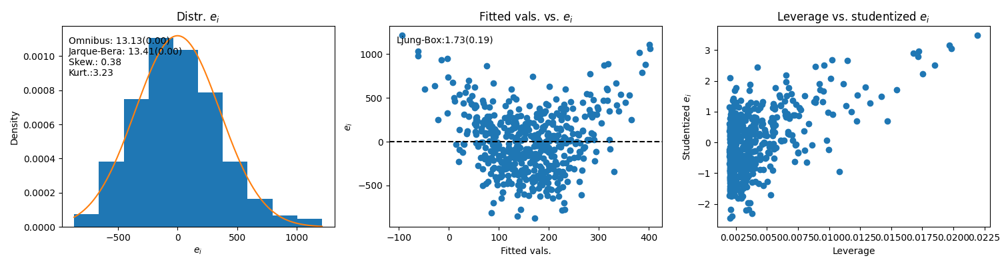
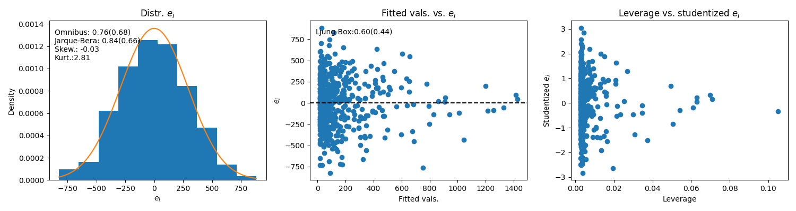
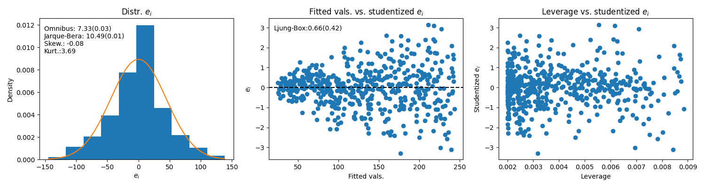

# Regression

## Ordinary least-squares - OLS

### Model and intuition

Model: $y = X\beta + \epsilon$, with $\epsilon \sim N(0, \sigma)$, $\beta= \langle\beta_0, \beta_1\rangle$ and $X$ a column vector (we prepend a column of ones on the left for the intercept). The deterministic part is $X\beta$, which is a model for $E(Y|X)$. $\epsilon$ is the random deviation of each $y_i$ from $E(Y|X)$, and is what makes $y$ a random variable.

The modelling task in OLS is to estimate $\hat{\beta}$ and its variability. That gives us a function to estimate of $E(Y|X)$ and a way to compute confidence intervals. $X$ is a matrix with $p$ columns and $n$ rows, where $p$ is the number of regressors and $n$ is the number of observations. In OLS, $p=1$. 

Geometrically, predicting $E(y|X)$ corresponds to projecting $y$ onto the column space of $X$, that is, finding a linear combination $\hat{\beta}$ of the columns of $X$ that minimizes the residuals vector $e = y - \hat{y}$, where $\hat{y} = X\hat{\beta}$. Since $e$ and $X$'s column space are orthogonal, we can say $X^T(y - X\hat{\beta}) = 0$. Solving for $\hat{\beta}$ yields:

$\hat{\beta} = (X^TX)^{-1}X^Ty$

The variance of $\hat{\beta}$'s sampling distribution can be obtained as follows: 

$Var(\hat{\beta}) = Var((X^TX)^{-1}X^Ty)$ 

$Var(\hat{\beta}) = Var((X^TX)^{-1}X^T(X\beta + \epsilon))$ (substituting in the equation for $y$)

$Var(\hat{\beta}) = Var((X^TX)^{-1}X^TX\beta + (X^TX)^{-1}X^T\epsilon)$ (expanding)

$Var(\hat{\beta}) = Var((X^TX)^{-1}X^T\epsilon)$ (because $Var(c + Z) = Var(Z)$)

$Var(\hat{\beta}) = (X^TX)^{-1}X^T Var(\epsilon)X(X^TX)^{-1}$ (because $Var(cZ) = c^2Var(Z)$)

$Var(\hat{\beta}) = \sigma^2 (X^TX)^{-1}X^T X(X^TX)^{-1}$ (defining $Var(\epsilon) = \sigma^2$)

Finally, noting that $(X^TX)^{-1}X^T X = I$, we get:

$Var(\hat{\beta}) = \sigma^2(X^TX)^{-1}$

This means that $Var(\hat{\beta})$ is related to 1) the variance of the residuals $\sigma^2 = Var(\epsilon)$ and 2) $X^TX$ (so-called Gram matrix), which captures the degree to which regressors line up in $n$-dimensional space ($n$ = no. observations).

$\sigma^2$ is not observable, so we have to use the sample estimate $\text{RSE} = \hat{\sigma}^2 = \text{RSS}/(n-p-1)$, with $p$ = no. regressors (=1 in OLS) and $\text{RSS} = e^Te$, where $e$ = sample residuals (see below). $\text{RSE}$ = Residual Standard Error and $\text{RSS}$ = Residual Sum of Squares. We're allowed to use $\text{RSE}$ as an estimate of $\sigma^2$ becasue, _if the OLS assumptions hold_, $E(\hat{\sigma}^2) = E(\text{RSE}) = \sigma^2$

The entries in $X^TX$ are just the dot-products $X_j^TX_j$ for the diagonal elements and $X_j^TX_{-j}$ for the off-diagonal elements. The former are related to the variance of regressor $X_j$ and the latter to the pairwise covariances between $X_j$ and each of the other regressors $X_{-j}$.

In general, larger samples with more spread $X$ have smaller variability; the mechanism is simply that larger samples encompass a larger part of the population and hence have better chances of representing it well. In turn, more spread in $X$ implies more chances to capture the way $y$ varies over $X$. Conversely, a narrow interval of $X$ doesn't allow that and therefore leads to more variable (i.e., more uncertain) estimates of $\hat{\beta}$.

These formulas are only valid if $Cov(X, \epsilon) = 0$. The intuition here is that if $\epsilon$ is related to the regressors $X$, these contain information about the part of $y$ that is supposed to be only noise, i.e., there's still variance in $\epsilon$ that is linked to $X$. It's also possible that an omitted variable is moving with $X$ and thus affecting $y$ indirectly. This then causes $X$ and $\epsilon$ to be related. 

Since $Cov(X, \epsilon) = E(X\epsilon | X) - E(X)E(\epsilon | X) = XE(\epsilon) - E(X)E(\epsilon)$, the only way for $X$ and $\epsilon$ have zero covariance is if $E(\epsilon)=0$, which we achieve by correctly specifying the model (accounting for non-linearities and avoiding omitted variable bias). It's also worth noting that, with multiple regressors, checking which $X$ is responsible for $Cov(X, \epsilon) \neq 0$ helps determining which regressor drives the residuals.

### A final note on predicted values

Since $\hat{\beta} = (X^TX)^{-1}X^Ty$, the estimated values $\hat{y}$ are $\hat{y} = X\hat{\beta} = X(X^TX)^{-1}X^Ty$. The product $X(X^TX)^{-1}X^T$ is known as the 'hat' matrix $H$, since multiplying it with $y$ generates $\hat{y}$. Further, the matrix-vector product $Hy$, which is computed as 

$$\hat{y}_i = \sum_{i=1}^n h_{i,j}y_j$$

indicates that each $\hat{y}_i$ is a linear combination of all observed $y_i$, and that the degree to which each $y_i$ influences a given $\hat{y}_i$ is given by the corresponding row of $H$.

Another important fact about $H$ is that each of its diagonal elements $h_{i,i}$ is equal to the _leverage_ of the corresponding observation $(x_i, y_i)$. The diagonal entries of $H$ are $h_{i,i} = x_i(X^TX)^{-1}x_i^T$, and this measures how distant (from the center) $x_i$ is in the column space of $X$ (factor $(X^TX)^{-1}$ warps and scales space such that distance is measured in $X$'s column space instead of in Euclidean space, otherwise we'd simply have $\lVert x_i^2 \rVert$, i.e., the squared length of $x_i$). 

This 'distance', combined with an unusual value for $y_i$ (i.e., a large residual $e_i$), results in a strong _influence_ of that datapoint on $\hat{\beta}$, which in turn translates into a strong influence of that datapoint on the regression line as a whole. Leverage is relevant because if high-leverage points are also outliers, our entire analysis would be based on a single (or a few) atypical observations, which makes conclusions less reliable than if they were based on the dataset as a whole.

Note: the off-diagonal elements of $H = X(X^TX)^{-1}X^T$ are $h_{i,j} = x_i(X^TX)^{-1}x_j^T$, and these measure the alignment or 'cross-similarity' of $x_i$ and $x_j$ in the column space of $X$. In turn, the diagonal elements $h_{ii} = x_i(X^TX)^{-1}x_i^T$ measure the 'self-similarity' of $x_i$ with itself, which is actually the distance mentioned above (that distance is measured along the principal components of $X$).

Leverage is also important because it's needed to obtain studentized residuals; these are key for determining outliers because it's easier to spot them on a standard scale than on $y$'s natural scale. That standardization is done by divding each residual $e_i$ by its variance, which is equal to $Var(e_i) = \sigma^2(1-h_{ii})$. Intuitively, this relation means that residuals of datapoints with more leverage have less variability upon replication because those points 'pull' the regression line more strongly towards them. Thus, every replication leads to a regression line that moves little with respect to those high-leverage points, and therefore less variable $e_i$.

### Sums of squares and $R^2$

After finding $\hat{\beta}$ we can compute $\hat{y}$, which is an estimate of $E(y\mid X)$. We can then also compute sample residuals $e_i = y_i - \hat{y}_i$. With $e_i$ we can compute sample estimates for the distribution of $\epsilon$, which we obviously don't have so we're forced to use $e_i$'s distribution as a proxy. A first measure of interest is $\sigma^2$, i.e., the variance of $\epsilon$'s distribution.

We estimate this quantity with the **residual standard error** $RSE = \sqrt{\text{RSS}/(n-2)}$, where the **residual sum of squares** $\text{RSS} = \sum_{i=1}^n (y_i - \hat{y}_i)^2$ and $n-2$ are the degrees of freedom when computing $\text{RSE}$ in OLS. We lose 2 degrees of freedom becasue we need to estimate two parameters - $\hat{\beta}_0$ and $\hat{\beta}_1$ to calculate $\text{RSE}$; in MLR (see below) we lose $p + 1$ degrees of freedom ($p = no. regressors + 1 for the intercept).

These sums of squares can be used to compute the % of explained variance in the regression, the $R^2$ statistic. $R^2 = 1 - \text{RSS}/\text{TSS}$, where the **total sum of squares** $\text{TSS} = \sum_{i=1}^n (y_i - \bar{y})$. This statistic measures the **linear** association between $X$ and $y$. In bivariate regression, the $R^2$ statistic is equal to the square of the _correlation coefficient_ $r^2$, which is equal to $Cov(X,y)/(\sqrt{Var(X)Var(y)})$. This is **not** true for multivariate settings.

Informally, looking at the size of RSS relative to the mean of $y$ is a way to assess how big unexplained variation is relative to the overall size of the response.

### OLS diagnostics

Before interpreting $\hat{\beta}_0$ and $\hat{\beta}_1$ and their statistical and business significance, we must check whether the linear model fit is usable. Several steps here:

1. Normality of residuals: Look at histogram of $e_i$ (sample residuals, since the population residuals require the entire population, which we obviously don't have). Formal tests: **Omnibus**, **Jarque-Bera**. Both have $H_0$: Distribution of $\epsilon_i$ is normal. However, given the Central Limit Theorem, normality of residuals is less critical with larger sample sizes ($n > 30$)

2. Autocorrelation of residuals: Look at fitted values vs. $e$. A random pattern suggests (however does not prove!) true linearity between $X$ and $y$. Any trend means systematic over/underpredicting depending on $y$; for instance, small values of $y$ overpredicted and large values of $y$ underpredicted -> we're likely missing a quadratic term -> model is **misspecified**. There can of course be other trends in fitted vals. vs. residuals: points along bands -> missing categorical variable, points funnel-shaped -> heteroscedasticity, etc. Formal test: **Ljung-Box**. Tests $H_0$: Zero residual autocorrelation.

3. Fitted values vs studentized residuals: This plot allows finding outliers and patterns in residuals (the same as above). The fact that residuals are studentized makes it easier to determine outliers (when the $t$ value is higher than, say 3). 

4. Leverage v studentized residuals: Outliers are bad, but outliers with high leverage are worse. Points with high leverage have a strong influence on $\hat{\beta}$ and can therefore distort relations since the regression would be heavily biased by only a few datapoints. Outliers with low leverage are less problematic, although they increase $RMSE$ and therefore lead to lower $R^2$.

## Multiple linear regression - MLR

### Model and intuition

Model is the same as above: $y = X\beta + \epsilon$, with $\epsilon \sim N(0, \sigma)$, but now $\beta$ is a vector of shape ($p$+1, 1), with $p$ = number of regressors (+1 for the intercept), and $X$ is no longer a column vector but a matrix of shape ($n$, $p+1$), i.e, $n$ observations and $p$ factors (again, +1 for the intercept, for which we prepend a column of ones to $X$).

Having multiple regressors opens up a host of possibilities, good and bad. Good because the world is multidimensional and including multiple regressors accounts for this; bad becasue regressors could be non-independent, we could be missing the right regressors, and we are forced to select a model, not to mention the problems with wide $X$ matrices, i.e., many features + few observations, and 'the curse of dimensionality'. More on all of these below.

In order to find $\hat{\beta}$ with $\hat{\beta} = (X^TX)^{-1}X^Ty$, **$X^TX$ must be invertible**, which requires the columns of $X$ to be _linearly indepenent_ (i.e., $X$ must have full column rank). The formula for $Var(\hat{\beta})$ is the same as in OLS (OLS is just a special case of MLR).

Intuitively, each entry $\hat{\beta}_j$ in **$\hat{\beta}$** is the slope of the relationship between $X_j$ and $E(y|X)$ _holding all other predictors fixed_. That is, $\hat{\beta}_j$ measures the **true** effect of $X_j$, or, in other words, it isolates the effect of $X_j$ by measuring it **in the presence of all other factors**. Indeed, the entries in vector $\hat{\beta}$ are 

$\hat{\beta}_j = \frac{r_j^Ty}{r_j^Tr_j}$

This is the **partial covariance formula**, and $r_j$ are the residuals of regressing $X_j$ against all other regressors $X_{-j}$. $r_j^Ty$ measures how much variation in $r_j$ lines up with variation in $y$, and dividing by $r_j^Tr_j$ sets that quantity in relation to the total variation in $r_j$.

The intuition behind partial covariance is: with multiple regressors, we can't directly use $X_j^Ty/(X_j^TX_j)$ to capture how much $X_j$ varies together with $y$. The reason is that the other regressors ($X_{-j}$) could also influence $X_j$. That means **what we need to look at is the covariance of $y$ with the part of $X_j$ that is not explained by the other regressors** - this is what 'the effect of $X_j$ holding all other regressors fixed' actually means. 

The part of $X_j$ not explained by the other regressors is captured by the residuals of regressing $X_j$ on all other regressors. $r_j$ can be understood as the 'isolated' variability of $X_j$, or as 'what remains' of $X_j$ after removing the influence of all other regressors. The covariance of that 'cleaned' $X_j$ with $y$ then gives the true, isolated effect of $X_j$ on $y$ in the presence of all other regressors. In terms of vectors and spaces, $r_j$ is always orthogonal to $X_{-j}$. Remember that a regression simply finds the projection of $y$ onto the column space of $X$, and the vector of residuals is the orthogonal distance between $y$ and that projection.

### Omitted variable bias

When we omit relevant regressors we are 'burying' the effect of the factors that are actually relevant in the $\hat{\beta}_j$ of the factors we do include. This happens when the omitted regressors meet two conditions: 1) the omitted regressors correlate with $y$ **and** 2) the omitted regressors correlate with the included regressors. Formally: 

Suppose the true model is $y = X\beta + \epsilon$. Say $X$ is of shape (n, m), but we only include $k$ regressors ($k < m$), i.e., we leave $m-k$ regressors out of the model. We can say $X$ is made up of two parts (included and omitted columns), so we can write it as $X = [X_1 \ X_2]$, with $X_1$ = the included regressors and $X_2$ = the omitted regressors. Each of these is just a matrix, one with the included ($X_1$) and another with the omitted ($X_2$) columns of $X$.

With this split, we can write the true model as $y = X_1\beta_1 + X_2\beta_2 + \epsilon$, where we've also split $\beta$ into an included part $\beta_1$ and an omitted part $\beta_2$. By implication, $X\beta = X_1\beta_1 + X_2\beta_2$.

Then our incomplete model is $y = X_1\alpha + \delta$, and $\hat{y} = \hat{\alpha}X_1$, so $\hat{\alpha}$ is the regression coefficient we estimate when we only include the subset of regressors $X_1$ ($\delta$ is the residual of this incomplete model). Now, by definition

$\hat{\alpha} = (X_1^TX_1)^{-1}X_1^Ty$. If we substitute in the true model for $y$, we can see how the missing $X_2$ influences $\hat{\alpha}$:

$\hat{\alpha} = (X_1^TX_1)^{-1}X_1^T(X_1\beta_1 + X_2\beta_2 + \epsilon)$. If we expand this:

$\hat{\alpha} = \beta_1[(X_1^TX_1)^{-1}X_1^TX_1] + (X_1^TX_1)^{-1}X_1^TX_2\beta_2 + (X_1^TX_1)^{-1}X_1^T\epsilon$ (the 1st term in square brackets is $I$, the identity matrix). This simplifies to:

$\hat{\alpha} = \beta_1 + (X_1^TX_1)^{-1}X_1^TX_2\beta_2 + (X_1^TX_1)^{-1}X_1^T\epsilon$

If we take the expected value given $X_1$, $X_2$  on both sides:

$E(\hat{\alpha} | X_1, X_2) = \beta_1 + E[(X_1^TX_1)^{-1}X_1^TX_2\beta_2 | X_1, X_2] + E[(X_1^TX_1)^{-1}X_1^T\epsilon | X_1, X_2]$. Since $E(\epsilon | X_1, X_2)=0$,

$E(\hat{\alpha} | X_1, X_2) = \beta_1 + (X_1^TX_1)^{-1}X_1^TX_2\beta_2$

This result indicates that the expected value of $\hat{\alpha}$ is $\beta_1$ **plus a bias** (remember that bias = how much the expected value of our estimate deviates from the true value). That bias depends on 1) $\beta_2$ - the true effect of the omitted variable on $y$ and 2) $X_1^TX_2$ - how much the included and omitted regressors covary.

$(X_1^TX_1)^{-1}X_1^TX_2$ -> this term has two parts: $X_1^TX_2$ measures how strongly the included ($X_1$) and omitted ($X_2$) regressors covary, and $(X_1^TX_1)^{-1}$ acts as a 'distributor' of the previous quantity. Namely, this factor 'allocates' bias to the entries of $\hat{\alpha}$ based on how redundant the columns of $X_1$ are. Columns of $X_1$ that can be predicted from the others (collinear regressors) get more bias (due to the way entries in $(X_1^TX_1)^{-1}$ capture $Var(x_1,j)$ vs. $Cov(x_1,j, x_{1,-j})$ -> the variance and covariance of the included regressors).

In summary, if we omit variables that are possitively associated with $y$ and with $X_1$ (the included regressors) we will have inflated coefficients for the regressors we do include, since they represent the true value $\beta_1$ plus the bias $(X_1^TX_1)^{-1}X_1^TX_2\beta_2$. If the omitted variables are negatively associated with $y$ and with the included regressors, coefficient estimates will be smaller because the true effect will be dampened by the bias. In cases where the omitted variables have a positive (negative) relation with $y$ and a negative (positive) relation with $X_1$, the net effect depends on whether $\beta_2$ or $X_1^TX_2$ is larger.

### Hypothesis test

In MLR, we test $H_0: \beta_j = 0$ vs. $H_A:$ at least one $\beta_j \neq 0$, and the test statistic is 

$F = \frac{(\text{TSS} - \text{RSS})/p}{\text{RSS}/(n-p-1)}$.

What $F$ does is set the model effects ($TSS - RSS$) in relation to the residuals. If $X$ and $y$ _are_ related, $\text{RSS}/p$ will be smaller than $(\text{TSS} - \text{RSS})/(n-p-1)$, making $F > 1$. $F$ follows an F-distribution, which determines how much larger than 1 $F$ must be to be statistically significant.

#### Testing individual or subsets of regressors

When deciding whether a subset $q$ of regressors is relevant, we can remove those $q$ regressors from the model, fit it, and compare the residual sum of squares of that reduced model $\text{RSS}_0$ with the $\text{RSS}$ of the full model (the one with all regressors).

If the omitted regressors are important, $\text{RSS}_0$ will be much larger than $\text{RSS}$, since omitting relevant regressors will lead to larger residuals. Formally, what we're doing is testing the hypothesis $H_0$: 

$\beta_{p-q+1} = \beta_{p-1+2} ... \beta_p = 0$, 

where $\beta_{p-q+1} = \beta_{p-1+2} ... \beta_p$ are the omitted regressors. The comparison is done via an F-test:

$F = \frac{(\text{RSS}_0 - \text{RSS})/q}{\text{RSS}/(n-p-1)}$,

where the numerator captures the rise in $\text{RSS}$ we observe by removing the $q$ regressors - this measures the contribution of the $q$ omitted regressors. Since this measures the contribution of $q$ regressors, we divide by $q$ in order to get the 'residual rise per omitted regressor'.

This same logic can be used to asses inividual regressors. Actually, if we square the $t$-value of each individual regressor in an MLR, we get the $F$ value of a regression that omits that variable. Again, the logic here is: if we remove regressor $X_j$ and fit the model, and then compare the resduals to the full model, there should be a increase in $\text{RSS}$ if $X_j$ was important. 

To test whether the omitted $q$ regressors are non-zero, we can't just fit a model with those $q$ regressors and check if they're non-significant. The reason is ommited variable bias - if the omitted $p-q$ regressors are correlated with the included ones, that bias will likely make the latter non-zero. The only way to avoid this is to take those $q$ regressors out of the model and fit the other $p-q$ regressors. That way, we can check if removing those $q$ regressors affects $\text{RSS}$, which is what we check with the above F-test. Note: if the removed $q$ regressors are correlated with the included ones, the F-test will have less power (because the effect of the omitted $q$ variables will still bias the $p-q$ included regressors, and this will lead to slightly smaller $\text{RSS}_0$).

### Variable selection

In MLR, the first step is to do the F-test with all regressors to see if there's an effect at all of _any_ of the predictors. If we do reject $H_0$, we obviously want to know _which_ predictors are relevant. This is called **model selection**. See next chapter.

One interesting fact regarding including/removing variables is how $\text{RSS}$ and $\text{RSE}$ react to adding regressors. It's perfectly possible to have, say, a model with 3 regressors with an $\text{RSS}$ of 10 and an $\text{RSE}$ of 3.5, and then, after including a fourth regressor, have $\text{RSS}$ drop to 8 (becase $\text{RSS}$ can only drop with more regressors, since we're adding dimensions) while $\text{RSE}$ grows to 4. The reason is simple: given that $\text{RSE} = \sqrt{RSS/(n-p-1)}$, $\text{RSE}$ can grow if the drop in $\text{RSS}$ is smaller than the increase in $p$.

### Confidence vs prediction intervals

The estimated mean of $y$ at some specific value $x_0$ ($x_0 = \langle x_{1,0}, x_{2,0}, ... x_{p,0} \rangle$, i.e., a specific row of $X$) is $\hat{y}_0 = x_0\hat{\beta}$, and it's normally distributed with mean $x_0\beta$ and variance $\sigma^2x_0(X^TX)^{-1}x_0^T$. Since we don't have $\sigma^2$ we use $\hat{\sigma}^2 = s^2 = \text{RSS}/(n-p)$. With these quantities we can build a **confidence interval** for $\hat{y}_0$:

$$\hat{y}_0 \pm t_{1-\alpha/2, n-p}\sqrt{\frac{\text{RSS}}{(n-p)}x_0(X^TX)^{-1}x_0^T}$$

This confidence interval captures how our estimate $\hat{y}_0$ varies upon replication. It reflects the fact that our estimate of $E(y|X=x_0)$ is based on a sample, and it's only equal to the actual population value in the limit. 

**Prediction intervals** capture the uncertainty of predicting, not the mean of $y$ given $X$, but a **specific value** $y_0$ at a specific $x_0$, i.e., an individual realization of the random variable $y$. Because this is a harder prediction task, prediction intervals are wider than confidence intervals. The reason is that, even if we could magically sample the entire population, fit a model with that 'data', and then make a prediction for $y_0$, we'd indeed get the true $E(y|X=x_0)$ (confidence interval collapses to a point) but we'd still have a _distribution_ of values around that true mean, simply because **$y$ is a random variable**. 

Formally, $y_0$ is the actual value at $x_0$ and our prediction is $\hat{y}_0 = x_0\hat{\beta} + \epsilon_0$. Notice we _must_ include $\epsilon_0$ because we're predicting a single value of the distribution, which is mean + random deviation ($\epsilon_0$). The estimation error here is $y_0-\hat{y}_0 = x_0\beta - x_0\hat{\beta} + \epsilon_0$. What we then need to build the prediction interval is how this prediction error varies upon replication, i.e., $Var(y_0-\hat{y}_0)$. This variance is $Var(y_0-\hat{y}_0) = Var(x_0\beta - x_0\hat{\beta} + \epsilon_0)$. After some algebra, this becomes $Var(y_0-\hat{y}_0) = \sigma^2(1 + x_0(X^TX)^ {-1}x_0^T)$, which is basically a sum of the uncertainty in $\hat{\beta}$ (the second term) and the variability of $y$ around its true mean $E(y|X=x_0)$ (the first term). With this variance, the prediction interval for $\hat{y}_0$ is:

$$\hat{y} \pm t_{1-\alpha/2, n-p}\sqrt{\frac{\text{RSS}}{n-p} (1 + x_0(X^TX)^{-1}x_0^T)}$$

Notice this is very similar to the confidence interval except for the $1+$ in the square root, which accounts for the population-level variability in $y$.

## Key issues in MLR

### Interaction terms

MLR has two big assumptions: effects are 1) _linear_ - the effect of $X_j$ on $y$ is the same at all values of $X_j$ and 2) _additive_ - the effect of $X_j$ on $y$ does not depend on the other predictors $X_{-j}$. Including interaction between regressors relaxes the second assumption. 

Formally, if our original model is $y = \beta_0 + \beta_1X_1 + \beta_2X_2 + \epsilon$, we can replace $\beta_1$ by $\tilde{\beta}_1$, which we then define as a function of $X_2$. The new model is $y = \beta_0 + \tilde{\beta}_1X_1 + \beta_2X_2 + \epsilon$, where $\tilde{\beta}_1 = \beta_1 + \beta_3X_2$. Intuitively, what this does is introduce a slope for $X_1$ that varies linearly as a function of $X_2$. If we reorganize the equation like this:

$y = \beta_0 + \tilde{\beta}_1X_1 + \beta_2X_2 + \epsilon$

$y = \beta_0 + (\beta_1 + \beta_3X_2)X_1 + \beta_2X_2 + \epsilon$

$y = \beta_0 + \beta_1X_1 + \beta_2X_2 + \beta_3X_1X_2 +  + \epsilon$

we get the more familiar form for MLR with interaction. If it's significant, the interaction term $\beta_3$ in this example model is interpreted as the average increase in the effect of $X_1$ on $y$ by unit increase in $X_2$.

Interestingly, it can happen that the interaction term is significant but not the two associated main effects. In that case, the 'hierarchical principle' indicates those non-significant main effects should still be kept in the model. The rationale is: if the interaction exists, whether main effects are zero or not is irrelevant because those factors must be present for an interaction to take place at all. Also, those main effects are likely correlated with the interaction term, so leaving them out makes no sense.

### Interaction with qualitative terms

This particular setup is very useful, namely in situations where we're studying the relationship of $y$ with an $X$ that has quantitative and qualitative columns. The binary fields act as 'switches' that split the regression line into several (because their regression coefficient will be multiplied by either 0 or 1) and the interaction between the quantitative $X_j$ and the binary $X_j$ determines which slope each of those separate regression lines will have (because the 0/1 fields switch the additional slope terms 'on' and 'off'). This can be illustrated with an example using one quantitative ($x_1$) and one binary ($x_2$) regressor. Our model would be:

$y = \beta_0 + \beta1x_1 + \beta_2x2 + \beta_3x_1x_2$

Since $x_2$ only takes on values 0 or 1, the model can be written as:

$$
y = \begin{cases}
(\beta_0 + \beta_2) + (\beta_1 + \beta_3)x_1 + \epsilon & \text{if } x_2 = 1, \\
\beta_0 + \beta_1x_1 + \epsilon & \text{if } x_2 = 0,
\end{cases}
$$

That way, the regression equation for $x_2 = 1$ has intercept $\beta_0 + \beta_2$ and slope $\beta_1 + \beta_3$, while the corresponding intercept and slope for $x_2 = 0$ are $\beta_0$ and $\beta_1$. This means that the line for $x_2=1$ lies higher (assuming $\beta_2$ is positive) and has a steeper slope (assuming $\beta_3$ is positive) than the line for $x_2=0$.

### Non-linearity and autocorrelated residuals

Any non-linear pattern in the residuals plot (fitted values vs. residuals) suggests the model is missspecified. This can mean missing predictors (**confounders**), non-linear or interaction terms, and manifests as autocorrelated residuals, or _tracking_. The consequence is that the assumption $Cov(X, \epsilon) = 0$ does not hold, and therefore all calculations involving this assumption (like $Var(\hat{\beta})$) are 'off' by this amount, which leads to confidence intervals that are too narrow/optimistic (because we're underestimating variance).

This can be addressed by including a non-linear function of the existing regressor(s) and/or interaction terms. Non-linear terms can be, for instance, $X_j^c$, with $c$ = some power ('polynomial regression') or something like $log(X_j)$. For example, if our data-generating process is $y = \beta_0 + \beta_1X_1 + \beta_2X_1^2 + \epsilon$ but we fit $y = \beta_0 + \beta_1X_1 + \epsilon$, the residuals plot (in the middle) clearly shows a parabolic trend, suggestive of a missing quadratic term in the model. Note also the right-biased residuals distribution and the obvious pattern in the leverage vs. studentized residuals plot, showing that points with stronger leverage have larger residuals (which is very problematic). 

In contrast, if we include the quadratic term, $y = \beta_0 + \beta_1X_1 + \beta_2X_1^2 + \epsilon$, and that removes the parabolic trend in the residuals plot, the bias in the distribution of $e_i$, and the trend in the leverage vs. studentized residuals plot: 

### Heteroscedasticity

### Outliers

### Leverage

### Collinearity

inflated variance of beta

